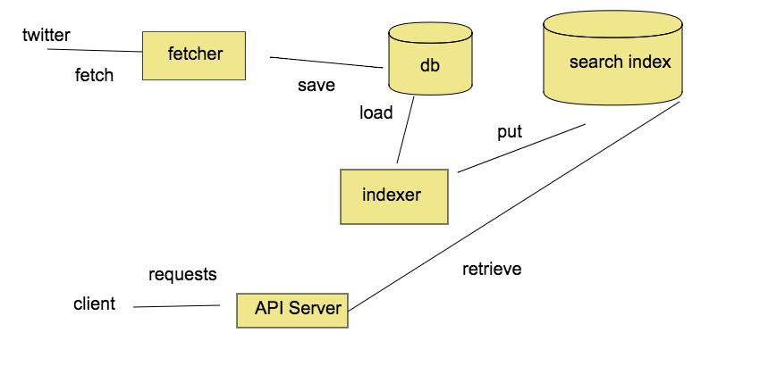

# Tweets Collector

HTTP REST API (with a frontend client) to search tweets fetched by
specific keyword via elasticsearch.

TODO: add navigation

## Overall Design

Components are loosely coupled which allows to scale them independently
and fail independently without affecting each other.

As API and frontend client server share nothing and don't have any
state they could be scaled by introducing new instances behind a load balancer.

Search index scaling is handled by Elasticsearch.

Database could be scaled by introducing sharded cluster (MongoDB is used).
Then multiple indexer instances could be introduced each indexing different db
shards.

One db instance is single point of failure which could be mitigated by
introducing replica set (or by using messaging to communicate between components
and get tweets to index from message queue, see below).

Components are decoupled and could be replaced with different implementations
while respecting the data model/communications protocol.

Further step more towards [Staged event-driven architecture](https://en.wikipedia.org/wiki/Staged_event-driven_architecture)
would be to use message broker to communicate between components. See diagram:
TODO: add messaging design diagram.

In this case fetcher will put new tweets inside something like
[RabbitMQ exchange](http://rubybunny.info/articles/exchanges.html) which will
route them to indexer message queue and another queue from which tweets
will be stored in database in order to save historical data between any restarts.
This would mean lower latency for tweets indexing as periodical search index
update would be replaced with updating index whenever new tweet appears in
indexer message queue, however message brokers introduce other concerns (e.g.
congestion).

### Fetcher
Gets tweets containing given keyword and stores them in database marked as not
indexed.

On start it uses Twitter search API (TODO: add link) to populate database with historical
tweets (since latest tweet in db if exists) as its only way to retrieve
historical data from Twitter (not older than 7 days due to the API limitation).
Then it uses  Twitter Stream API (TODO: add link) to pull new tweets.

It will fetch tweets only from public accounts.

### Indexer
First it re-creates search index and puts there all tweets from db,
then it adds scheduled job to periodically check database for not indexed tweets
and index them.

Cron-style scheduling is used to schedule indexer job, therefore adding latency
between storing new tweets and indexing them.

### API
HTTP server providing REST API with search endpoint querying Elasticsearch.
Search results are limited to 100 latest tweets.

Search endpoint is `/search?q=<words to search>`
It will perform case insensetive search for tweets containig all of words specified
in query separated by spaces.

## To Implement
Although network ports used by applications are configurable and not hardcoded
in each application itself, they are hardcoded in docker files and docker compose,
ports should be fully configurable.

Use docker volumes or data containers to permanently store db data.

API host URL not configurable for frontend-client.

Are graceful exits of services and graceful error handling and retries.

Retry connections to external services (db, search index) instead of failing.

Indexer now tries to bulk index all not indexed tweets - break bulk into chunks.
Prevent indexer job to start again when its already running.

Add API versioning.

Introduce API limits: probably limit
API improvements: search fields other then text, add simple query language.

UI improvements: show errors, show twitter author profile, add link to tweet.

Refactor code: flatten nested promises, change folders structure, improve error
handling.

## How To Start
Provide following env files for each component in top directory:
* fetcher.env
* indexer.env
* api.env

TODO: describe config for each component

As a shortcut API server host URL is not configurable in frontend-client,
so it should be changed in `frontend-client/src/config.js` file. I am using 
docker machine on Mac so I place there result of runnig `docker-machine ip default` command.

Run `docker-compose up` from a top level repo directory.

It takes some time to start all the services on my machine and they could become slow
and return timeout errors. This behaviour started after dockerizing
frontend-client, so one could remove it from docker-compose file and start as
usual.

Open frontend-client URL (http://<docker-machine ip>:3000) in browser.

